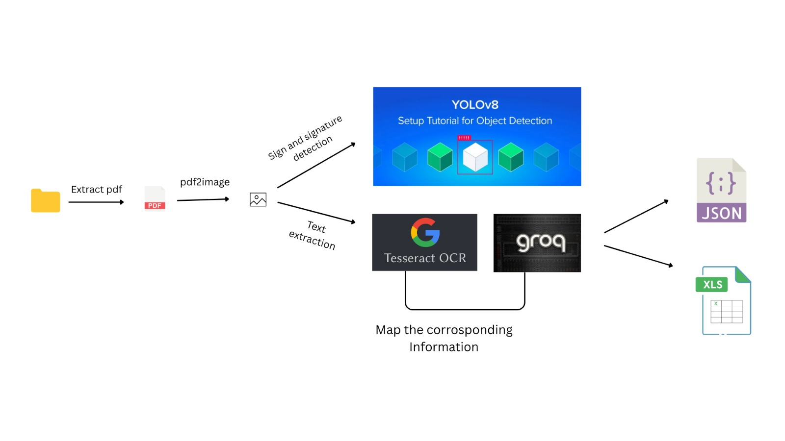
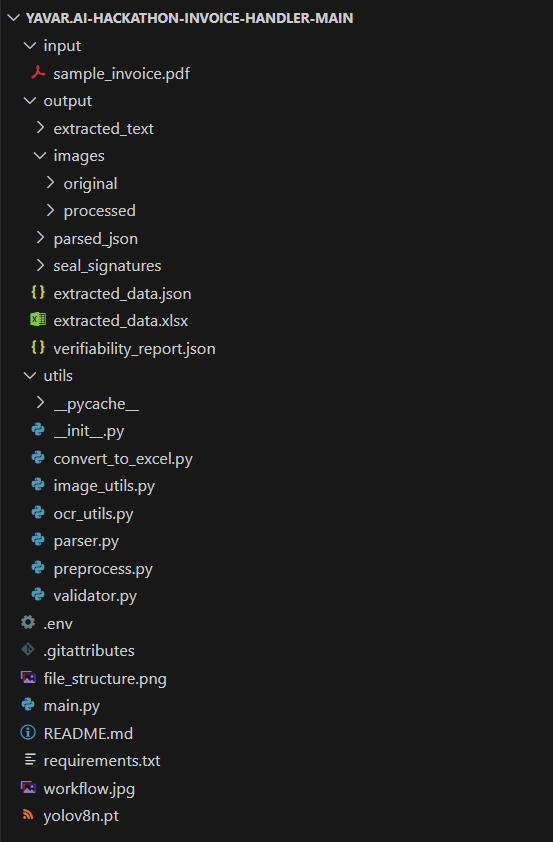

# Yavar.AI Hackathon Invoice Handler

# Invoice Extraction & Verification System

## 🚀 Overview

An Automated Invoice Processing System utilizes **OCR (Tesseract)** and **YOLOv8** to extract, validate, and process invoice data efficiently. It converts PDFs into structured **JSON and Excel reports**, ensuring accurate financial document handling while detecting seals/signatures for verification. Additionally, **Groq's Llama3 model** enhances text parsing, intelligently correcting and inferring missing invoice details.


## 🛠 Technologies Used

- **Python** → Main programming language for processing

- **Tesseract OCR** → Optical character recognition for text extraction

- **PDF2Image** → Converts PDFs into images for better OCR accuracy

- **OpenCV** → Preprocesses images (grayscale, sharpening, noise removal)

- **YOLOv8** → Deep learning model for seal/signature detection

- **Pandas** → Handles structured data, converts JSON to Excel output

- **LangChain & Groq's Llama3** → LLM-based intelligent text parsing & correction

- **dotenv** → Manages environment variables for API security

- **JSON** → Stores extracted invoice data in a structured format

- **Regex** → Cleans and refines OCR-extracted text

- **Subprocess** → Executes pipeline components dynamically

- **cv2 (OpenCV)** → Image transformations & noise reduction

- **NumPy** → Efficient array handling for image and text processing

## 🚀 How to Run the Project

**1️⃣ Clone the Repository**

```bash
git clone https://github.com/Bhavya-PR/Yavar.AI-Hackathon-Invoice-Handler
cd invoice-processing-system
```

**2️⃣ Install Dependencies**

```bash
pip install -r requirements.txt
```

## 3️⃣ Install & Configure Tesseract OCR

**📥 Download & Install Tesseract**
Download the latest version from: Tesseract-OCR for Windows

Install it to the default directory:

```bash
C:\Program Files\Tesseract-OCR\
```

## 🔧 Configure Tesseract in Your Project

After installation, set the Tesseract path directly in your code (as you've already done):

```bash
import pytesseract
pytesseract.pytesseract.tesseract_cmd = r"C:\Program Files\Tesseract-OCR\tesseract.exe"
```

## 4️⃣ Install & Configure Poppler for Windows

**📥 Download & Install Poppler**
Download Poppler from: Poppler for Windows

Extract the Poppler ZIP and move it to:

```bash
C:\Program Files\poppler-24.08.0\
```

## 🔧 Configure Poppler in Your Project

Set the Poppler path in preprocess.py:

```bash
from pdf2image import convert_from_path
POPPLER_PATH = r"C:\Program Files\poppler-24.08.0\Library\bin"

pages = convert_from_path(pdf_path, dpi=300, poppler_path=POPPLER_PATH)
```

## 5️⃣ Run the Project

```bash
python main.py
```

## File Structure


## Demo Video
[Demo Video For Invoice Handler](https://drive.google.com/drive/folders/11QP1McS6u0orVLN1PsFPv4WMIqK5LtCI?usp=sharing)
**Kindly ensure the video is viewed in high resolution for optimal clarity.**
